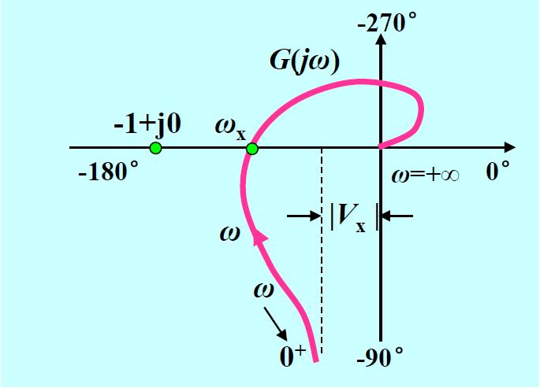
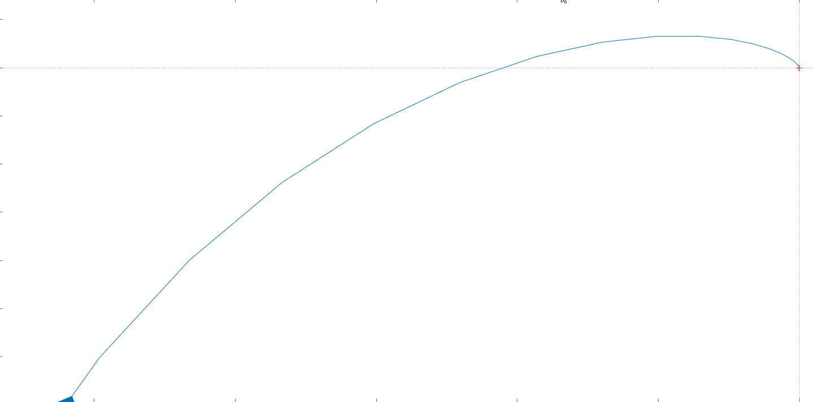

# Trick1

## 前言
事实上关于在频率响应这一章，主要内容就是Nyquist稳定判据、极坐标图与Bode图的绘制，当然还有一些零零散散的内容。但是本文主要关注于绘制1型以及一些高型系统Nyquist曲线时的一些细节。

### 说明
本文不会详细的阐述系统频率特性背后的原理于内容，只关注一些绘制的技巧与细节

## 1型系统Nyquist曲线

不妨，我们先假设所绘制的一型系统开环传函为：

$$G(s)H(s) = \frac{K}{s(T_m s + 1)(T_f s + 1)(T_q s + 1)}$$

明显可以看出这是一个一型系统，如下是随意取定$T_m$、$T_f$与$T_q$三个参数后得到的Nyquist曲线。

图1

在我们学习一些Nyquist画法后，我们可以较为容易的画出该开环传函Nyquist曲线的大致形状，可是，这里面仍有一些细节需要处理。

### 渐近线$x = |V_x|$

我们已经知道，对于一型系统，其Nyquist曲线其实角度$\theta_0$必为$-90\degree$。同时，其起始幅值$\lim\limits_{\omega \rightarrow 0}A(\omega)$ 必为 $-\infty$

虽然通过上述条件以及开环传递函数可以绘制Nyquist曲线 的大致形状，但是从上述条件我们无法确定$|V_x|$的值，我们也无法确定$|V_x|$是否收敛，就如同下面的图2一样。也就是说一型系统的具体曲线形状有几种可能，尽管一型系统Nyquist曲线形状类似，但是每种略有差别。其中$|V_x|$的值对绘制的Nyquist曲线至关重要。

图2

通过图1可以看出，$|V_x|$可以通过如下的方法求出：

$$ |V_x| = \lim\limits_{\omega \rightarrow 0} Re[G(j\omega)H(j\omega)] $$
按照传统做法（就比如课本上一贯的做法），我们需要将$s=j\omega$带入，然后化简得到其实部即$|V_x|$，通过$|V_x|$我们可以快速的确定其渐近线。
$$\begin{aligned}
G(j\omega)H(j\omega) &= \frac{K}{j\omega (T_m \omega j + 1) (T_f \omega j + 1) (T_q \omega j + 1) } \\ &= \cdots  = \Alpha(w) + \Beta(\omega)j
\end{aligned}$$

但是很不幸的是，上述的化简极其复杂。因此我们尝试使用一些技巧来快速的求出$|V_x|$

其实通过其开环传递函数$G(s)H(s)$我们能够很容易的写出其幅值特性与相角特性：
$$
\begin{cases}
A(\omega) &= \frac{k}{\omega \sqrt{(1 + T_m^2 \omega^2) (1+T_f^2 \omega^2) (1+T_q^2 \omega^2)} } \\
\phi(\omega) &= - 90\degree - arctan(T_m \omega) - arctan(T_f \omega) -arctan(T_q \omega)
\end{cases}$$

与传统做法不同，我们求解$G(j\omega)H(j\omega)$的实部并不是化简该公式，而是通过幅值与相角来求解:

$$
\begin{aligned}
|V_x| &= \lim\limits_{\omega \rightarrow 0} Re[G(j\omega)H(j\omega)] \\
&= \lim\limits_{\omega \rightarrow 0} A(\omega) cos(\phi(\omega)) \\
\end{aligned}
$$

这时候我们便可以使用微积分的技巧。当$\omega \rightarrow 0$时，明显$A(\omega) \rightarrow \frac{k}{\omega}$, 而$cos(\phi(\omega))$需要稍微做一些变换如下所示：

$$
\begin{aligned}
\lim\limits_{\omega \rightarrow 0} cos(\phi(\omega)) &= cos[- 90\degree - arctan(T_m \omega) - arctan(T_f \omega) -arctan(T_q \omega)] \\
&= -sin[arctan(T_m \omega) + arctan(T_f \omega) + arctan(T_q \omega)] \\
&= -[arctan(T_m \omega) + arctan(T_f \omega) + arctan(T_q \omega)]
\end{aligned}
$$

当我们写到这里时，就会发现$arctan(T\omega)$的等价无穷小正好是$T\omega$，然后$|V_x|$的求解变的异常简单。

$$
\begin{aligned}
|V_x| &= \lim\limits_{\omega \rightarrow 0} Re[G(j\omega)H(j\omega)] \\
&= \lim\limits_{\omega \rightarrow 0} A(\omega) cos(\phi(\omega)) \\
&= \lim\limits_{\omega \rightarrow 0} -\frac{k}{\omega} (arctan(T_m \omega) + arctan(T_f \omega) + arctan(T_q \omega))\\
&= \lim\limits_{\omega \rightarrow 0} - \frac{k}{\omega} (T_m \omega + T_f \omega + T_q \omega)\\
&=-k (T_m + T_f + T_q)
\end{aligned}
$$

当计算出来$|V_x|$是$-\infty$时，明显Nyquist曲线是不存在渐近线的。

## 确定Nyquist曲线的形状
为了确定Nyquist曲线的形状是图1还是图2，我们还得比较其穿越频率$\omega_x$与$|V_x|$的大小，这就涉及到如何求取$\omega_x$。事实上$\omega_x$的求取没有多少过于简单的方法，但是对于1型系统，我们依然能够很比较容易的求出来一个数值。

为了方便，我们举一个较为简单的例子。我们设开环传递函数如下：

$$ G(s)H(s) = \frac{1}{s(T_1 s + 1)(T_2 s + 1)}$$

这很容易写出其相角特性：

$$ \phi(\omega) = -90\degree - arctan(T_1 \omega) - arctan(T_2 \omega) $$

明显，$\omega_x$对应的相角为$-180\degree$，所以我们使用该相角特性求解$\omega_x$

$$
\phi(\omega_x) = -90\degree - arctan(T_1 \omega_x) - arctan(T_2 \omega_x) = -180\degree
$$
明显可得：
$$
\begin{aligned}
arctan(T_1 \omega_x) + arctan(T_2 \omega_x) &= 90\degree \\
arctan(\frac{\cdots}{1-T_1 T_2 \omega_x^2}) &= 90\degree
\end{aligned}
$$
其中两个$arctan$函数的和使用了如下的技巧。即当我们知道$tan(\alpha_1) = a_1$与$tan(\alpha_2) = a_2$则$tan(\alpha_1 + \alpha_2) = \frac{a_1 + a_2}{1 - a_1 a_2}$，如果对上面三个式子同取$arctan$便可以理解上面的过程。
通过这种方法，我们也可以十分容易的求出$\omega_x$。这时我们便可以将$\omega_x$带入$A(\omega)$中获得Nyquist曲线与$x$轴负半轴的交点，如果该交点位于$|A(\omega)|$的左侧，那么Nyquist曲线的形状应该类似于图1，否则应该类似于图2。

## Version
1.0.0

## License
Creative Commons 4.0 (CC-BY-NC-ND)
